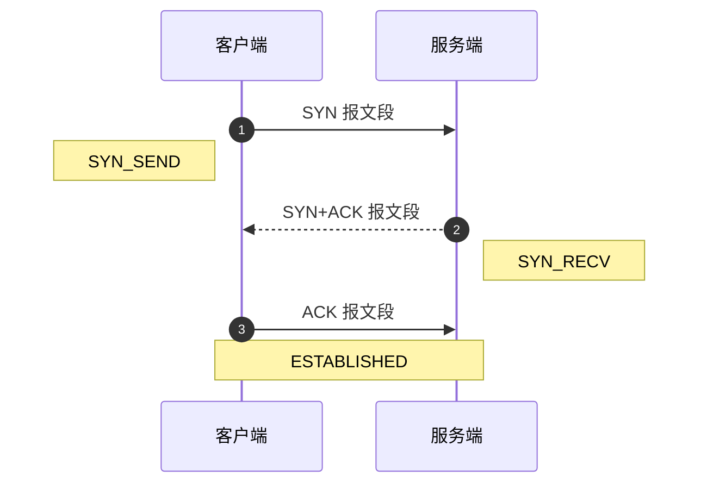
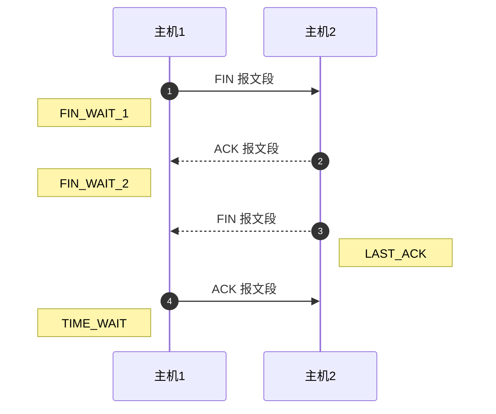

-   [地址栏输入 URL 后发生了什么](https://juejin.cn/post/6844904054074654728)
-   [网络通信原理](https://juejin.cn/post/6844903962216824839)

## 域名解析

依次查找：

1. 浏览器缓存
2. 本地的 hosts 文件
3. 本地 DNS 解析器缓存
4. 本地 DNS 服务器

## 建立 TCP 连接

## HTTP 请求

服务端解析请求头的缓存设置：if-none-match、if-modified-since，缓存有效则响应状态码为 304，否则状态码为 200。
详见[缓存机制](./缓存机制)

## 关闭 TCP 连接

