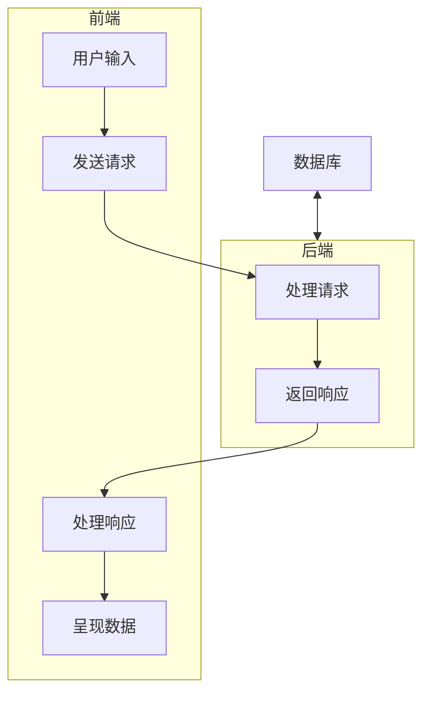
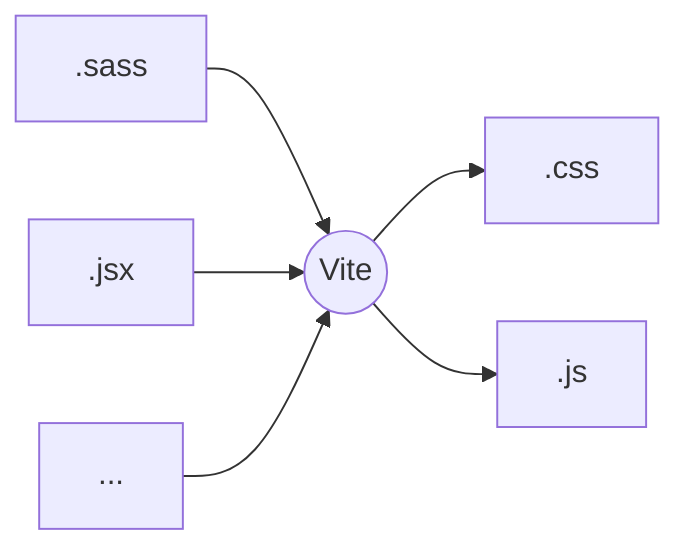
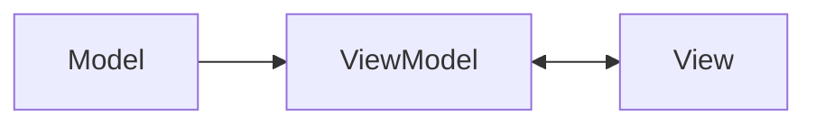

## 网络通信

通信是一种数据传输，网络通信就是通过网络进行数据传输。
通信的过程分为发送和接收，也被称为请求（Request）和响应（Response）。

我们在网络上进行的大部分操作，都是在与其他计算机进行通信。
比如，你给一个视频点赞，浏览器会向视频网站服务器发送请求，表示你对该视频进行了点赞操作，
然后服务器把这个信息记录到数据库中，完成后返回响应，表示你对该视频的点赞操作成功，
最后呈现点赞动画。

:::details 抓包
按下 `F12`，切换到 `Network`（网络）面板，按 `F5` 刷新页面，
可以看到浏览器发出所有的请求和响应。
捕获网络传输数据的操作称为抓包（Packet Sniffing）。
:::

对于大部分的 web 应用，数据流都是：



## 前端

前端开发通常指网页开发，是一种用户图形界面（GUI，Graphic User Interface）开发。
GUI 的职能无非就两个：呈现数据、处理用户输入。

### 网页构成

所有网页都是 HTML 文件渲染后的结果，详见[渲染原理](../Browser/渲染原理)。
随便打开一个网页，鼠标右键选择 “查看页面源代码”，这就是网页的 HTML 文件。
通常我们需要把其他文件引入 HTML 文件，被引入的文件类型对应不同标签：

```html

<style src="样式文件链接">
  /* 这里也可以写 CSS 语句 */
</style>
<script src="脚本文件链接">
  /* 这里也可以写 JS 代码 */
</script>
```

在现代前端开发中，我们通常只编写脚本文件。使用 JavaScript 可以创建标签：

```html
<script>
  const element = document.createElement('img');
  element.src = '图片链接';
  document.body.appendChild(element);
</script>
```

JavaScript 能做的事还有很多，我们可以通过它控制网页的所有细节，详见 [JavaScript](../Language/JavaScript/1.基础知识)。

### 工程化

在早些时候，开发者通常不会直接在 HTML 文件中写样式或脚本，
而是把它们拆分为文件，再通过 HTML 文件引入。
一个经典的前端项目的文件结构就像：

- js/
- css/
- index.html

此时的 JS 只能在浏览器上运行，后来出现了一个 JS 运行时：Node.js，它可以使 JS 在本地执行。
Node.js 提供了一些接口用于读写本地文件，
这意味着开发者可以不用再像以前一样写一堆 CSS 和 JS 文件，
而是用更简单高效的语法编写代码（如：sass、jsx），然后再交给编译器转换为 CSS 和 JS 文件。

但对于一个项目来说，有这么多使用不同扩展语法的代码文件，要分别对其进行一一编译实在麻烦。
如果能把所有文件扔给一个程序，让它对这些文件进行分别编译并合并成 1 个或几个文件，那就很省事了。
这就是打包工具做的事，以 Vite 为例：



### MVVM 架构

在学习任何一个前端框架前，需要了解所有前端框架的核心架构：MVVM。



- Model 层：处理除了用于呈现页面以外的数据，比如响应数据
- ViewModel 层：需要呈现的数据，和 View 层双向绑定
- View 层：负责把数据呈现到页面上

在没有框架时，要想实现呈现数据和处理用户输入，我们需要写很多代码：

```js
// 从页面中获取第一个标签为 <p> 的元素
const paragraphElement = document.querySelector('p');
// 呈现数据
paragraphElement.textContent = '要展示的文本数据';
```

```js
let inputValue = '';
const inputElement = document.quertSelector('input');
inputElement.addEventListener(
  'input',
  // 当用户向 inputElement 输入数据时，会触发这个函数
  function (event) {
    // 获取用户输入数据
    inputValue = event.target.value;
  },
);
```

我们可以发现，无论是页面呈现的数据还是用户输入的数据，它们都是作为页面元素的属性。
为了省去把数据和元素属性进行手动同步的这种 Dirty Work，开发者们打算把代码中实际操作的数据和元素属性进行双向绑定，
即：对数据的更改可以自动更新元素属性、元素属性的变化可以引起数据的自动更新。
这就是 ViewModel 和 View 层的双向绑定思想，要实现这种双向绑定，需要借助响应式系统。
参考 [Vue 响应式系统](https://cn.vuejs.org/guide/extras/reactivity-in-depth.html)。

实现数据绑定元素属性，就是在数据更改时，把数据赋值给元素属性。
实现元素属性绑定数据，就是在元素属性更改时，把元素属性赋值给数据。
所以问题的关键在于：怎么知道数据什么时候改变？元素属性什么时候改变？

## 后端（Node.js）

### 洋葱模型

## 数据库

### 实体关系图（ER 图）
