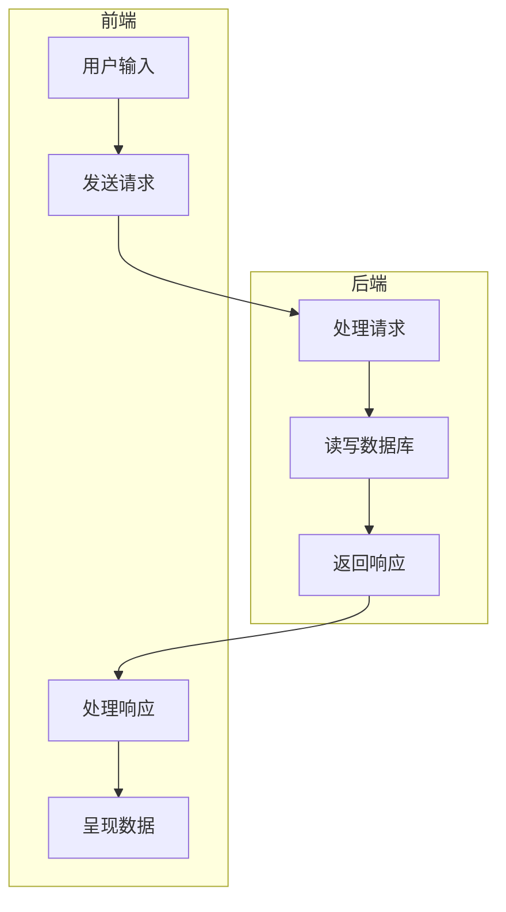

对于大部分的 web 应用，数据流都是：

```mermaid
graph TD
    subgraph 后端
        处理请求 --> 读写数据库 --> 返回响应
    end
    subgraph 前端
        用户输入 --> 发送请求
        处理响应 --> 呈现数据
    end
    发送请求 --> 处理请求
    返回响应 --> 处理响应
```

## 前端

前端开发通常指网页开发，是一种用户图形界面（GUI，Graphic User Interface）开发。
GUI 的职能无非就两个：呈现数据、获取用户输入。

## 后端

## 数据库
