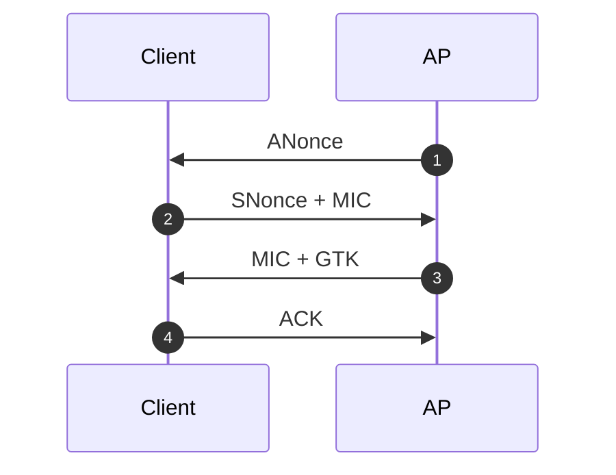
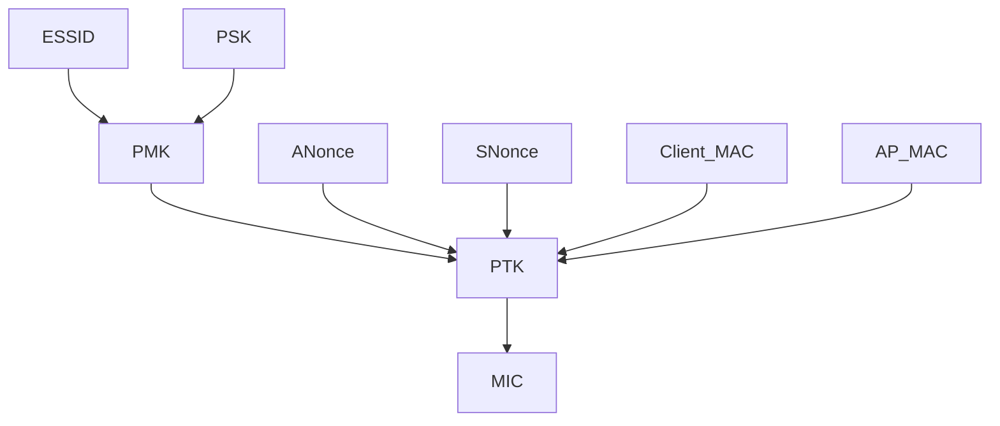

## WPA2-PSK

4 次握手：

```mermaid
sequenceDiagram
    autonumber
    participant a as Client
    participant b as AP

    b ->> a: ANonce
    a ->> b: SNonce + MIC
    b ->> a: MIC + GTK
    a ->> b: ACK
```

生成 MIC：

```mermaid
graph TB
    ESSID & PSK --> PMK
    PMK & ANonce & SNonce & Client_MAC & AP_MAC --> PTK
    PTK --> MIC
```
