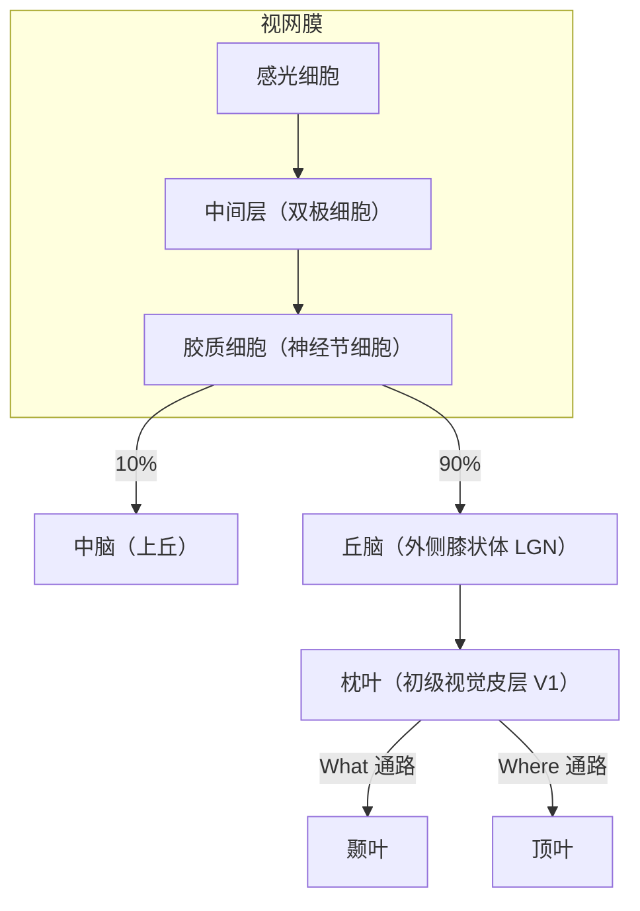
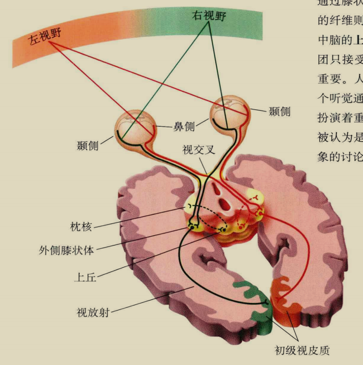

## 视觉

### 神经通路

视觉系统的信息流大致是：



感光细胞分为视锥细胞（颜色敏感）和视杆细胞（弱光敏感）。
感光细胞内有感光色素，这些色素遇光分解放能，引发动作电位。不同的感光色素对不同波段的光线的敏感性不同，依此可以把视锥细胞分为红绿蓝 3 种。

神经节细胞数量远不及感光细胞，这导致了信息压缩，不过在后期处理中大脑会依据有限的信息进行“脑补”。


视网膜-丘体通路这 10%的视神经被认为和盲视现象有关。



| 皮质通路   | 功能                   | 信息输入   | 位置偏好     | 物体偏好             |
| ---------- | ---------------------- | ---------- | ------------ | -------------------- |
| What 通路  | 物体知觉、识别         | 双侧       | 中央凹       | 部分细胞偏好复杂物体 |
| Where 通路 | 空间知觉、分析空间关系 | 主要是单侧 | 中央凹、外周 | 任何物体             |

### 面孔识别

梭状回（尤其是右半球）对面孔知觉起重要作用，它被激活的特定区域被称为梭状回面孔区 FFA。
另外，面孔能引发更大幅度的 N170（[ERP 成分](./研究方法#erp-成分)）。

:::info 补充
视知觉受损导致视觉记忆逐步丧失
:::

## 注意

这里我们主要关注注意的选择性，选择性注意在早期使用**双耳分听范式**研究。

双耳分听范式就是给被试的两只耳分别输入不同的信息，并要求被试只注意一只耳的信息（同时复述信息），最后要求被试输出全部信息。

### 理论

1. 早期选择模型

    通常情况下，被注意的信息报告准确率更高。
    所以研究者认为在信息加工的早期存在一个过滤器，它能把所有非注意信息排除在外。

    ```mermaid
    graph LR
    感觉 --> f((过滤)) --> 加工 --> 反应
    ```

2. 晚期选择模型

    但如果非注意信息中存在对被试有意义的信息（被试的名字），被试也能准确报告这些信息。
    于是研究者认为过滤其实发生在信息加工的晚期，也就是在完成语义分析后再过滤，因为只有通过语义分析才知道信息是否有意义。

    ```mermaid
    graph LR
    感觉 --> 知觉分析 --> 语义分析 --> f((过滤)) --> 决策/记忆 -->  反应
    ```

所以早期选择模型做出了妥协，它认为过滤器其实不是“全或无”地工作，而是把非注意信息进行衰减，至于有意义信息将在语义分析时得到加强。

### 神经机制

### ERP 成分

## 记忆

### 理论

### 海马

## 言语

### 字词加工

### 失语症

## 情绪

## 免疫
