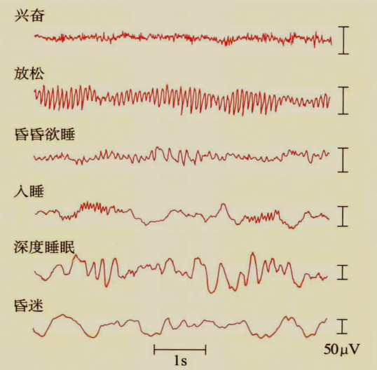
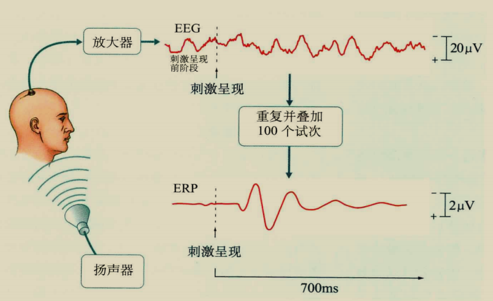
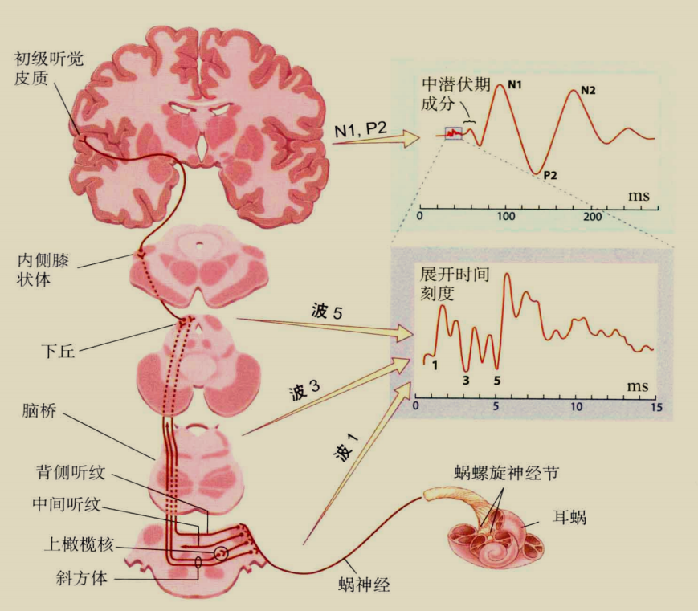
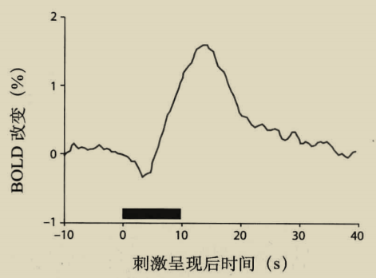

## 脑电图 EEG

脑内神经元的电活动使头皮电位变化，EEG 信号就是这种电位变化

## 事件相关电位技术 ERP

特定事件发生时产生的电位变化称为 ERP 信号，这种信号幅度小并难以从背景中区分。
所以就让事件重复发生，记录每次事件发生时的 EEG 信号，叠加平均后得到 ERP 信号

> 刺激：来自扬声器的声音  
> 事件：大脑接收刺激

### ERP 成分

早、中期信号波幅较小，表示神经信号从感受器传导至大脑皮层的过程，不同的波分别对应大脑结构的神经活动

晚期信号是与事件相关的，但由于 EEG 信号只表示头皮电位变化，
特定区域的大脑皮层会进一步把信号传递给其他区域皮层，引发广泛的头皮电位变化，所以很难将晚期成分定位到具体的脑区

### 波形测量方法

### 源定位分析

定位：从头皮电位数据推断出脑内具体的电信号源位置

-   逆向偶极子建模

    在头模型内部加入偶极子（电信号源）模拟人脑内部电活动，将模拟的头皮电位分布与实际数据比较

### 实验范式

-   Odball
-   Go-Nogo

## 功能性磁共振成像 fMRI

脑成像技术通过测量神经元的新陈代谢变化来探测脑神经活动。
:::info 正电子发射断层扫描 PET
为了测量局部脑血流变化，需要事先为血液注入同位素（$^{15}O$）  
同位素衰变会发射正电子，正电子与电子湮灭产生 2 个方向相反的光子（$\gamma$射线），将被仪器探测
:::

### 原理

fMRI 通过测量脑血流变化判断哪个脑区较活跃，其测量指标是：
$$BOLD_{血氧水平依赖效应}=\frac{N_{血红蛋白}}{N_{脱氧血红蛋白}}$$
这种方法的实现得益于脱氧血红蛋白对磁场更敏感（顺磁性）

> 刺激呈现后会有一个迅速的下降（神经活动导致耗氧量增加），随后开始上升（血流增加）  
> 血液调控总是更慢一步，这使得 fMRI 的时间分辨率不如 ERP

### 实验设计

## 灰度阈值化区域分割技术
