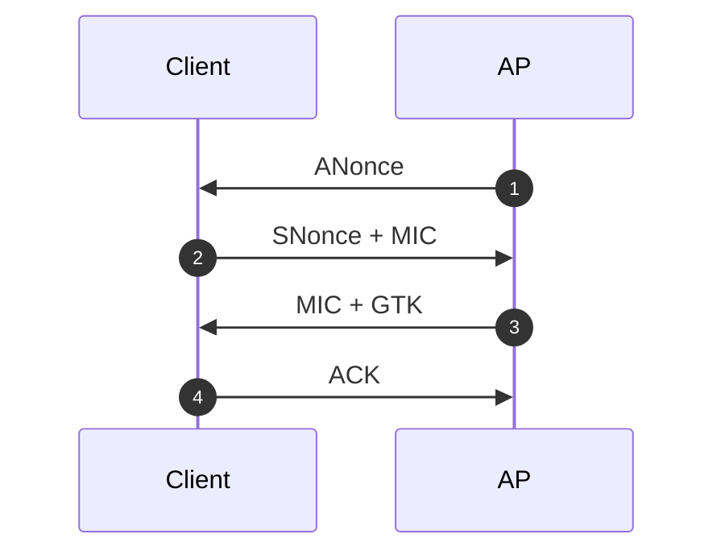
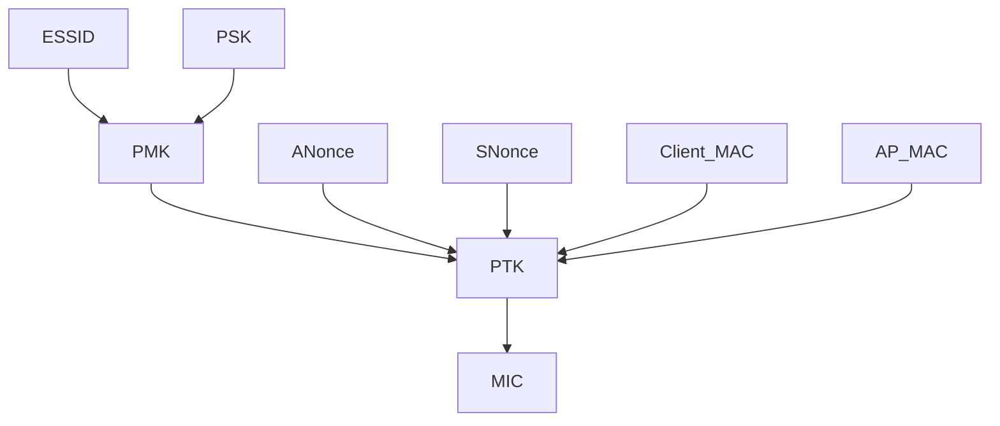

## WPA2-PSK

4 次握手：

生成 MIC：

## requestAnimationFrame, rAF 源码分析

- [How Blink works](https://docs.google.com/document/d/1aitSOucL0VHZa9Z2vbRJSyAIsAz24kX8LFByQ5xQnUg)
- [How cc works](https://chromium.googlesource.com/chromium/src.git/%2B/master/docs/how_cc_works.md)
- [Life of a Pixel](https://docs.google.com/presentation/d/1boPxbgNrTU0ddsc144rcXayGA_WF53k96imRH8Mp34Y)
- [Rendering Architecture Diagrams](https://www.chromium.org/developers/design-documents/rendering-architecture-diagrams/)

---

调用栈：

- https://chromium.googlesource.com/chromium/blink/+/refs/heads/main/Source/core/dom/Document.cpp
- https://chromium.googlesource.com/chromium/blink/+/refs/heads/main/Source/core/dom/ScriptedAnimationController.cpp
- https://chromium.googlesource.com/chromium/blink/+/refs/heads/main/Source/web/PageWidgetDelegate.cpp
- https://chromium.googlesource.com/chromium/blink/+/refs/heads/main/Source/web/WebViewImpl.cpp
